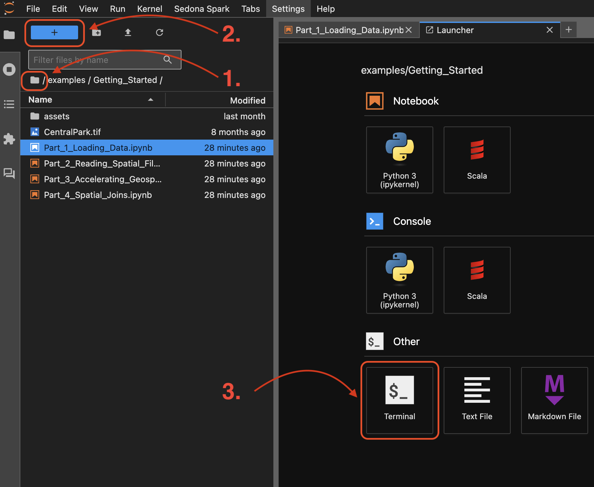

# AWS Geo Day 2025
Wherobots &lt;> AWS Geo Day 2025


# Get started

## Prerequisites

- Have a Wherobots account.
- Notebook instance is ready.

## Clone the repository



1. Click the "folder" icon to go to the root directory.
2. Click the blue "+" icon.
3. Click on the "Terminal" icon in the launcher tab.
4. Clone the repository by copying and pasting the following command into your terminal:
```shell
git clone https://github.com/wherobots/aws-geo-day-2025.git
```
5. Happy coding!